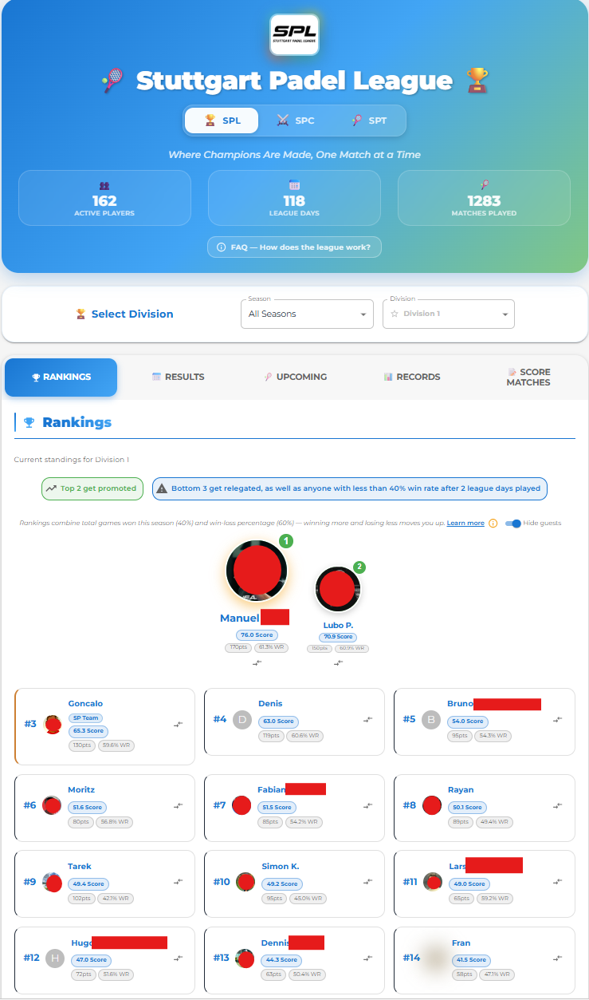
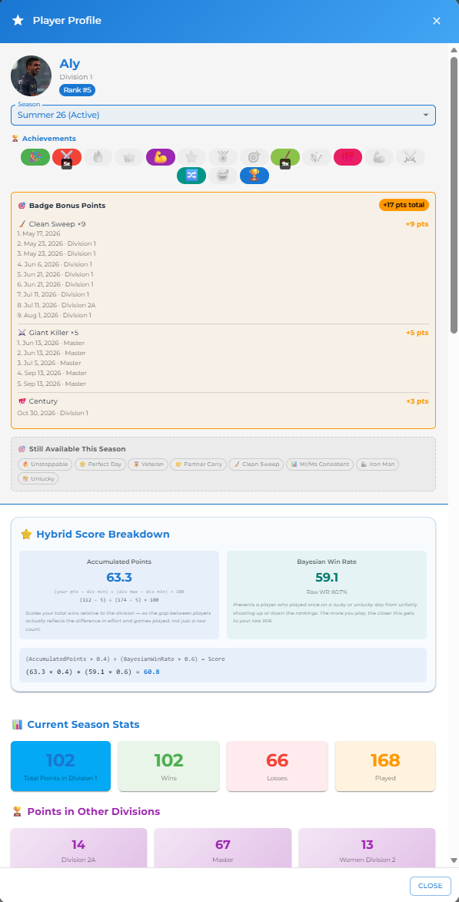
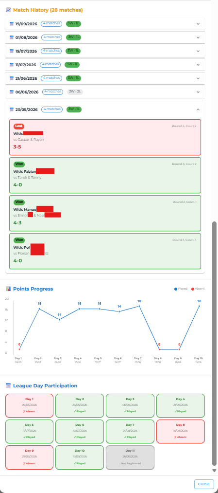
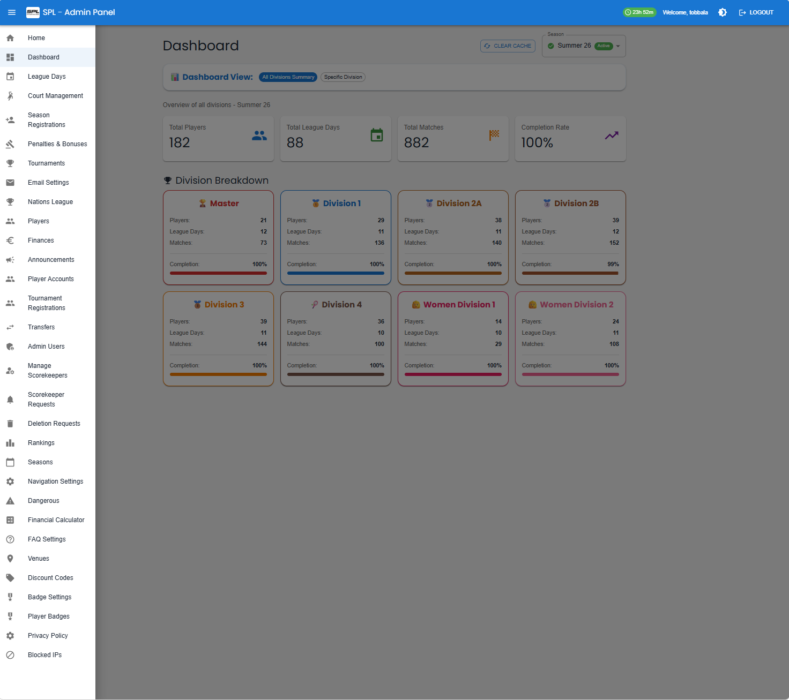

# Stuttgart Padel League Platform

A full-stack platform that runs an amateur padel league end to end: player registration, season and league-day scheduling, live match scoring, rankings, tournaments, payments tracking, and admin tooling.

**[Live demo: scores.stuttgart-padel.com](https://scores.stuttgart-padel.com)**

> The source code is kept private because this is a running product. Happy to give a live code walkthrough in an interview.

## Screenshots

**Public home: live rankings per division and season**



**Player profile: badges, score breakdown and season stats**



**Player profile: match history, points progress and league day participation**



**Admin panel: dashboard and the full set of management tools**



## What it does

**For players**
- Register for seasons, manage profile, privacy settings and account
- View league days, matches, rankings and personal stats
- Earn badges based on results
- Register for tournaments and find partners via a partner board

**For scorekeepers and admins**
- Live match scoring on mobile
- Manage seasons, divisions, league days, courts and venues
- Tournament management (including Americana format and a Nations League format) with configurable points
- Penalties and bonuses, transfers between divisions, discount codes, finances overview
- Announcements, FAQ and email configuration
- QR-code based gift pickup scanning
- Abuse protection: IP and device blocklist

**Platform**
- Multi-organization support with role-based access (player, scorekeeper, admin, super admin)
- Scheduled jobs (e.g. league-day reminder emails)
- GDPR-minded features: privacy policy management, privacy settings, account deletion requests

## Tech stack

| Layer | Technology |
|---|---|
| Frontend | React 18, TypeScript, Material UI, React Router, dnd-kit (drag and drop), Axios |
| Backend | Node.js, Express, TypeScript |
| Database and storage | Google Cloud Firestore, Cloud Storage, Firebase |
| Auth | JWT, bcrypt, role-based middleware |
| Email | Brevo, Resend, Nodemailer, AWS SES |
| Security | Helmet, CORS, express-rate-limit |
| Jobs | node-cron |
| Hosting | Netlify (frontend), Railway with Docker (backend) |

## Architecture

```
 Browser (React SPA, Netlify)
        |  HTTPS / REST + JWT
        v
 Express API (TypeScript, Railway)
   |-- Auth middleware (player / scorekeeper / admin / super admin)
   |-- Organization middleware (multi-tenant scoping)
   |-- Rate limiting, Helmet, CORS
   |-- Route modules: seasons, league days, matches, tournaments, stats, finances, ...
   |-- Cron jobs (reminders)
        |
        v
 Firestore (data)   Cloud Storage (images)   Email providers
```

Roughly 40 API route modules and 70 frontend pages, all in TypeScript.

## My role

Designed, built and deployed the whole system on my own: frontend, backend, data model, deployment, and operations for real users.

## Interesting problems solved

1. **Ranking and stats integrity.** Player stats are derived from match results across seasons and divisions, with recalculation and migration scripts to keep data consistent when rules changed.
2. **Multi-role, multi-organization access.** One codebase serves players, scorekeepers, admins and super admins with per-organization data isolation.
3. **Handling abuse in production.** A real user cloned the public site, so I built an admin-managed IP and device blocklist.

## Contact

Interested in a walkthrough of the code or architecture? Reach out via my GitHub profile or the contact details on my CV.
